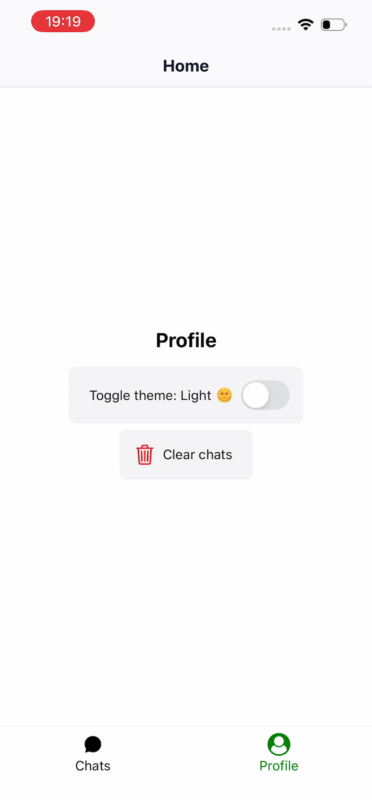

# Chat Demo App

A simple chat application demonstrating react native skills for Ropstam hiring.



## Features

- Bottom tab navigation
- User data persist
- Responsive UI
- Simulated notification

## Libraries Used

- Framework: Expo
- State management: Zustand
- Local storage: AsyncStorage
- Notifications: Expo Notifications
- Styling: Nativewind

## Getting Started

1. Clone the repository:
   ```bash
   git clone https://github.com/yourusername/chat-demo-app-v1.git
   ```
2. Install dependencies:
   ```bash
   cd chat-demo-app-v1
   yarn install
   ```
3. Start the development server:
   ```bash
   yarn start
   ```

## Usage

- Select one of the chats and send simulated messages.
- You can tap heart icon to add the conversation to the favorites
